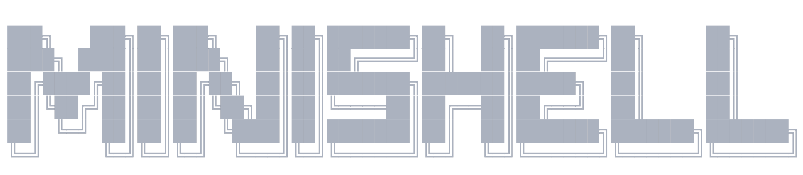

Allowed functions and usage examples: [Functions.md](/docs/Functions.md)

## Installation

To install and use minishell, you need:

1. Clone this git repository
    
    ```bash
    git clone https://github.com/tesla33io/minishell.git
    ```

2. Navigate into `minishell` and build the executable
    ```bash
    cd minishell
    make
    ```

3. Now you can use `minishell` executable to run minishell on your machine.

4. Additionally you can create a symlink for minishell
and move it to the directory on the `$PATH`
to use minishell from any part of the file system
    ```bash
    ln -s minishell /usr/bin/minishell
    ```

## Builtins

A **struct** that consists of two elements, the name of the command (_builtin_) and **a pointer to the appropriate function.** (?)

1. `echo` with `-n` support (maybe some other arguments)
2. `cd` (only relative or absolute path)
3. `pwd`
4. `export`
5. `unset`
6. `env`
7. `exit`


## Useful resources

[Chapter5-WritingYourOwnShell](https://www.cs.purdue.edu/homes/grr/SystemsProgrammingBook/Book/Chapter5-WritingYourOwnShell.pdf)

[`> file` vs `>& file`](https://g.co/gemini/share/18247f4d0570)

---

Allowed functions and usage examples: [Functions.md](/docs/Functions.md)
